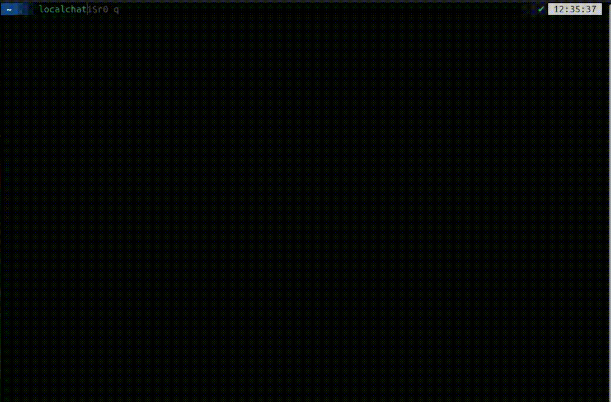

## What is the Localchat?
Localchat is minimalist software that lets you communicate with other users on the same local network who also use Localchat. Users are discovered automatically and communication takes place in the format of everything with everyone. Just enter your name and start chatting!

# How to install?
See the release notes for installation instructions

# How does user discovery happen?
Each client sends UDP Broadcast requests for its presence, so other clients can see it. If a client stops sending requests, the other clients remove it from the list of online users

# What platforms are supported? 
The application is tested on Windows 10, Ubuntu 24.04 and Debian 11 (via Docker image, see installation and launch instructions in the release), all systems are AMD64

# How do I compile an application from source?
First of all, make sure you have cmake version 3.28 or higher installed. You should also have C++ compilers that support the C++ 23 standard installed, such as g++ 14 or MSVC (included with Visual Studio 2022). Then follow the instructions:
- Download the source code and unzip it
- Run `mkdir build && cd build` in the terminal
- Run `cmake ..` and wait for the configuration to complete (download and configuring dependencies)
- Run `cmake --build . --parallel` (`cmake --build . --parallel --config Release` on Windows)
- For Debian-based systems: after building, you can run `cmake --build . --target package` to generate a `.deb` package with localchat

## License

This project is licensed under the [MIT License](./LICENSE).

It uses third-party components:

- [FTXUI](https://github.com/ArthurSonzogni/FTXUI) — MIT license
- [jsoncpp](https://github.com/open-source-parsers/jsoncpp) - MIT license
- [net](https://github.com/AlexandreRouma/net) - LGPL-3.0 license
- [netif](https://github.com/GMLC-TDC/netif) - BSD-3-Clause license

See [third party](3dparty) for details
